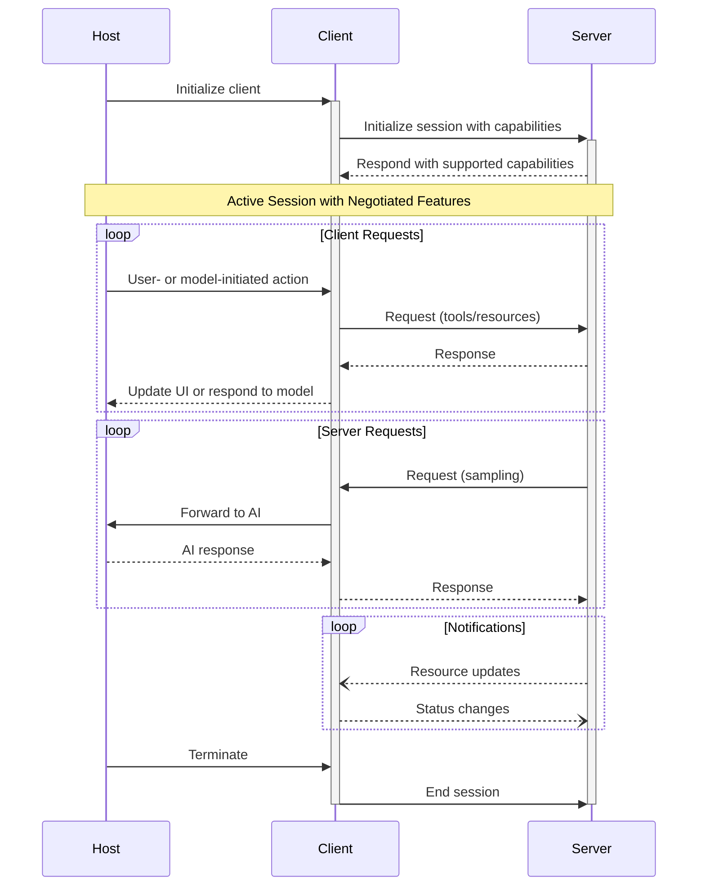
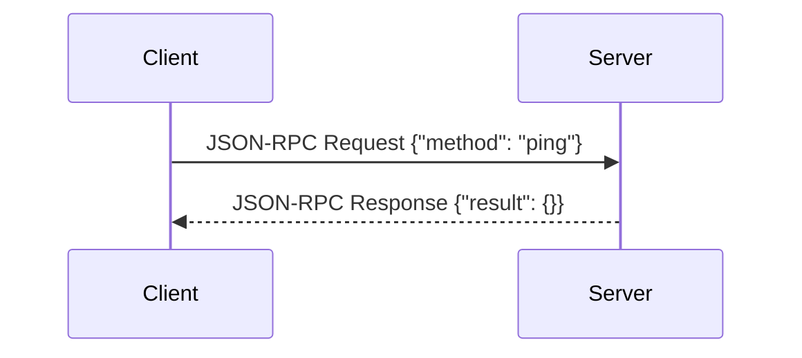

# Ping

<EpicVideo url="https://www.epicai.pro/workshops/day-1-setup-intro-and-tools/intro~xh5mj" />

The Model Context Protocol requires a few things:

1. A client that can send standardized requests to the server
2. A server that can receive those requests and respond to them
3. A transport that can send requests from the client to the server and
   responses back

For advanced servers, this communication channel should be two-way, meaning the
client can send requests, but also receive requests from the server.

In MCP, the client initiates the connection. We're focused on building the server
in this workshop. The client will be the MCP inspector which you can use within
the workshop app. You can also configure an MCP client of your own if it
supports the Model Context Protocol we're implementing.

The transport mechanism we'll be using in this exercise is `stdio`, which is
built-into the TypeScript SDK for MCP. This means the client will initiate the
connection by spawning a new process and then use STDIO to communicate with it.

<callout-info>
	The most interesting servers you'll likely build will actually use an HTTP
	transport so your users don't need to install anything to use it. But we'll
	keep things simple and not much changes in this workshop by using `stdio`.
</callout-info>

## MCP Initialization

Here's what happens when the client initializes the session with the server:



<callout-success>
	This is all handled by the MCP SDK automatically. Once you set up your server
	and connect it to a transport, the SDK will handle the initialization and
	negotiation of capabilities.
</callout-success>

## MCP `ping`



<callout-success>
	The MCP SDK handles the ping request for you. Just get the server set up with
	a transport and you're good to go.
</callout-success>

A "ping" is a common concept in protocol design. It's a simple request to check
if a connection is working. In this exercise, we'll implement a `ping` tool
for our MCP server.

In MCP, the client can send a `ping` request to the server to make sure it's up
and running. This request looks like this:

```json
{
	"jsonrpc": "2.0",
	"id": "123",
	"method": "ping"
}
```

The server will respond with a `pong` response:

```json
{
	"jsonrpc": "2.0",
	"id": "123",
	"result": {}
}
```

<callout-muted>
	Note the distinct lack of "pong" in the response 😒 How disappointing.
</callout-muted>

You'll notice this is a `jsonrpc` request and response. This is the standard way
to send requests and receive responses in the MCP specification.

In this exercise, we'll set up our server to respond to `ping` requests.
