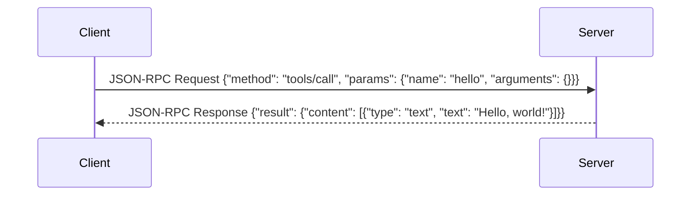
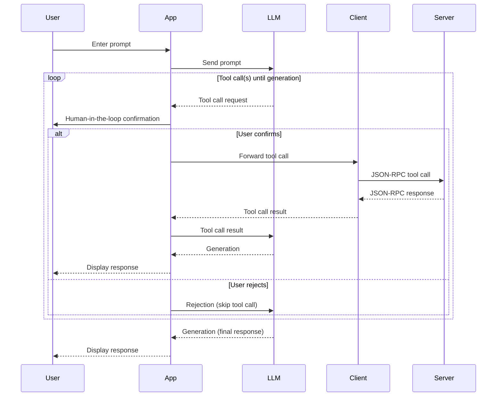

# Tools

<EpicVideo url="https://www.epicai.pro/workshops/day-1-setup-intro-and-tools/intro~r0cbh" />

The Model Context Protocol (MCP) enables language models to interact with
external systems through a concept called "tools." Tools are server-defined
functions that can be invoked by clients (like LLMs or user interfaces) to
perform specific actions—such as calculations, data lookups, or API calls—using
a standardized protocol.

In MCP, each tool is uniquely named and described, and its expected input
parameters are defined using a JSON Schema. When a client wants to use a tool,
it sends a request specifying the tool's name and the required arguments. The
server executes the tool and returns the result in a structured format, which
can include text, images, audio, or even references to additional resources.

In the future, hopefully we can even respond with UI! For more on this, check
out my post
[The future of AI interaction: Beyond just text](https://www.epicai.pro/the-future-of-ai-interaction-beyond-just-text-w22ps).

<callout-success>
	From [the MCP
	Spec](https://modelcontextprotocol.io/specification/2025-06-18/server/tools):
	Tools in MCP are designed to be **model-controlled**, meaning that the
	language model can discover and invoke tools automatically based on its
	contextual understanding and the user's prompts. However, implementations are
	free to expose tools through any interface pattern that suits their needs—the
	protocol itself does not mandate any specific user interaction model.
</callout-success>



For trust and safety, MCP encourages a "human-in-the-loop" approach: users
should be able to see which tools are available, confirm sensitive operations,
and review tool inputs and outputs. The protocol also supports dynamic discovery
of available tools and notifies clients if the tool list changes.

The whole flow looks something like this:



<callout-warning>
	Note: The only part of this which is technically specified by MCP is the
	communication between the client and server. The rest of the user experience
	is up to however the host application wants to do it.
</callout-warning>

## Example: Defining a Simple Tool

```ts lines=7
import { McpServer } from '@modelcontextprotocol/sdk/server/mcp.js'

const server = new McpServer(
	{ name: 'hello-world-server', version: '1.0.0' },
	{
		capabilities: {
			// add the tools object to explicitly declare that this server supports tools
			tools: {},
		},
		instructions: 'A simple hello world server.',
	},
)

// register a tool with the server
server.registerTool(
	// llm-facing name
	'hello',
	{
		// user-facing title
		title: 'Hello',
		// llm-facing description (clients could also display this to the user)
		description: 'Say hello',
		// add a schema to validate the input
		inputSchema: {
			// the input description is llm-facing, (the user may see it as well)
			name: z.string().describe('The name to say hello to'),
		},
	},
	async ({ name }) => {
		return {
			content: [{ type: 'text', text: `Hello, ${name}!` }],
		}
	},
)
```

Example client request:

```json
{
	"jsonrpc": "2.0",
	"id": 1,
	"method": "tools/call",
	"params": {
		"name": "hello",
		"arguments": {
			"name": "Kody"
		}
	}
}
```

Example server response:

```json
{
	"jsonrpc": "2.0",
	"id": 1,
	"result": {
		"content": [
			{
				"type": "text",
				"text": "Hello, Kody!"
			}
		],
		"isError": false
	}
}
```

In this exercise, you'll extend your MCP server to declare support for tools and
implement a simple tool that performs addition. You'll start by exposing a basic
tool with a hardcoded response, then evolve it to accept parameters and return
dynamic results based on user input. This will give you hands-on experience with
MCP's tool registration, input validation (using [Zod](https://zod.dev/)
schemas), and result formatting.

- 📜 [MCP Spec: Tools](https://modelcontextprotocol.io/specification/2025-06-18/server/tools)
