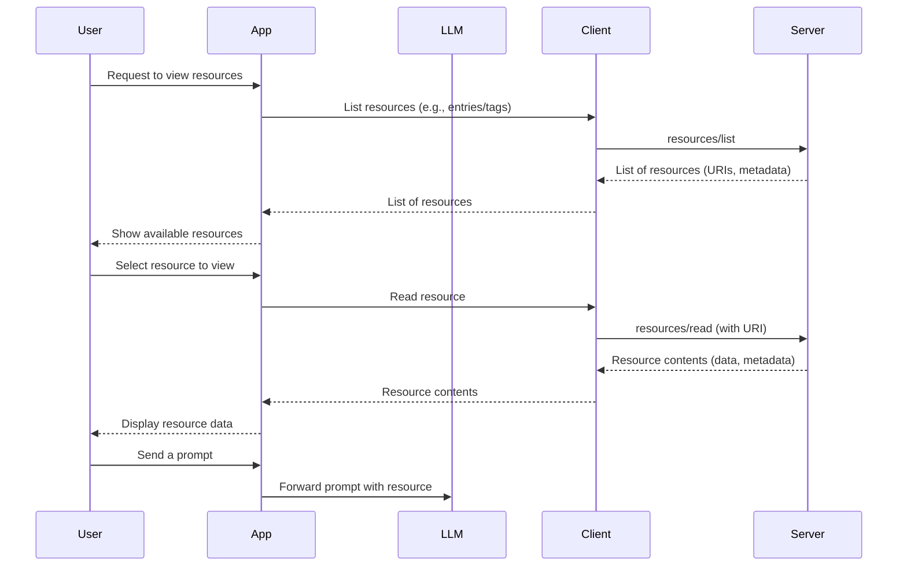

# Resources

In previous exercises, you learned how to extend your MCP server with
tools—server-defined functions that let clients perform actions or retrieve
data. But sometimes, what you want to expose isn't just a function, but a
_resource_: a file, a database record, or some other piece of structured data
that can be read (and sometimes listed or searched) by clients.

The Model Context Protocol (MCP) has the concept of **resources** to make this
possible. Resources are a standardized way for servers to share contextual data
with clients—such as files, database entries, or application metadata—using a
uniform interface. Each resource is uniquely identified by a URI and can be
described with metadata like a name, description, and MIME type.

<callout-success>
	From [the MCP
	Spec](https://modelcontextprotocol.io/specification/2025-06-18/server/resources):
	Resources in MCP are designed to be **application-driven**, with host
	applications determining how to incorporate context based on their needs.
	However, implementations are free to expose resources through any interface
	pattern that suits their needs—the protocol itself does not mandate any
	specific user interaction model.
</callout-success>

Here's what this user experience may feel like.



<callout-warning>
	Reminder, the MCP spec only defines the relationship between client and
	server. The rest of the user experience is controled by the creator of the
	client.
</callout-warning>

Example request to read a resource:

```json
{
	"jsonrpc": "2.0",
	"id": 2,
	"method": "resources/read",
	"params": {
		"uri": "taco://menu/items/carne-asada"
	}
}
```

Example response:

```json
{
	"jsonrpc": "2.0",
	"id": 2,
	"result": {
		"contents": [
			{
				"uri": "taco://menu/items/carne-asada",
				"mimeType": "application/json",
				"text": "{\"name\":\"Carne Asada Taco\",\"ingredients\":[\"steak\",\"tortilla\",\"onion\",\"cilantro\"],\"instructions\":\"Grill the steak, chop into small pieces, serve on warm tortillas\"}"
			}
		]
	}
}
```

This approach enables a wide range of use cases:

- Exposing files or documents for LLMs to read and reference
- Making database records (like journal entries or tags) available as structured
  resources

<callout-success>
	Really, a resource is anything you would traditionally have done with a GET
	request on a web server.
</callout-success>

Here are a couple other examples of URIs you might use for a resource:

```
datetime://Euroupe/London/now
http://example.com/llms.txt
jira://myworkspace/ticket/304
amazon://product/1234567890
```

📜 If you're unfamiliar with URIs and their formats, you can read more about
them on Wikipedia:
[Uniform Resource Identifier](https://en.wikipedia.org/wiki/Uniform_Resource_Identifier).

MCP resources are designed to be application-driven: you decide what to expose,
and how. Clients can list available resources, read their contents, and
(optionally) subscribe to updates or changes. The protocol supports both static
resources (like a credits file) and dynamic, parameterized resources (like a
database entry with a specific ID).

In this exercise, you'll extend your EpicMe journaling app to expose new types
of resources:

- **Tags**: A simple resource returning all available tags.
- **Resource Templates**: Journal entries and tags, each accessible via a
  unique URI and discoverable through resource templates.

By the end, you'll have hands-on experience with MCP's resource capabilities,
including resource registration, templates, and embedding resources in tool
responses. This will set the stage for building applications that can share
rich, structured context with language models and other clients.

<callout-warning>
	You'll notice we have a bunch of tools for reading data which you might think
	we should just use resources for. Unfortunately, all the popular MCP clients
	as of today are very limited in their use of resources so we'll keep those
	tools around. In the future, we should just use resources for this stuff.
</callout-warning>

- 📜
  [MCP Spec: Resources](https://modelcontextprotocol.io/specification/2025-06-18/server/resources)
