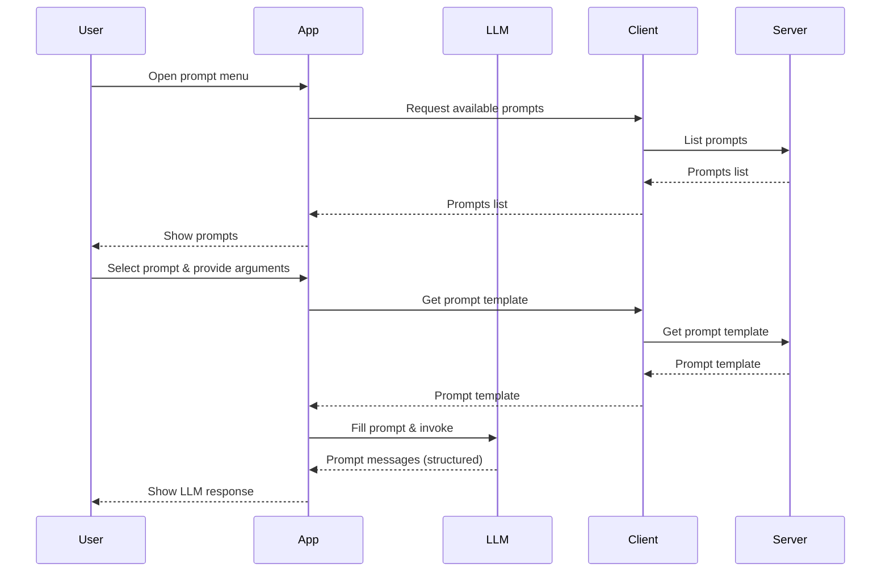

# Prompts

Sometimes there are common workflows for people using your MCP server you want
to make easier for users. You may not want your users to have to write the same
prompt all the time for that workflow (not everyone is a "prompt engineer").

The Model Context Protocol (MCP) has a specification for **prompts** as a way
for servers to expose reusable, structured instructions to language models and
clients. Prompts are more than just static text—they can be parameterized and
invoked by users to guide model behavior in a consistent, transparent way.

With prompts, servers can offer a menu of available instructions (like
"summarize my journal entries from last week," "write alt text for this image"
or "review this code"), each with a clear description and customizable
arguments. This enables richer, more user-driven interactions, where clients can
select and fill in prompts as needed.

<callout-success>
	From [the MCP
	Spec](https://modelcontextprotocol.io/specification/2025-06-18/server/prompts):
	Prompts are designed to be **user-controlled**, meaning they are exposed from
	servers to clients with the intention of the user being able to explicitly
	select them for use. Typically, prompts would be triggered through
	user-initiated commands in the user interface, which allows users to naturally
	discover and invoke available prompts. However, implementors are free to
	expose prompts through any interface pattern that suits their needs—the
	protocol itself does not mandate any specific user interaction model.
</callout-success>

Here's an example of how the user experience might look:



<callout-warning>
	Again, the only part here that's specified is the client and server
	communication. The rest is up to whoever implements the client.
</callout-warning>

For example, a server might expose a simple "hello world" prompt:

```ts
import { z } from 'zod'

agent.server.registerPrompt(
	'hello_world',
	{
		title: 'Say hello to the user',
		description: 'Say hello to the user',
		argsSchema: {
			name: z.string().describe('The name of the user to say hello to'),
		},
	},
	async ({ name }) => ({
		messages: [
			{
				role: 'user',
				content: { type: 'text', text: `Hello, ${name}!` },
			},
		],
	}),
)
```

Clients can discover available prompts, retrieve their templates, and supply
arguments to customize the resulting messages. Prompts can include not just
text, but also images, audio, or references to server-managed resources—enabling
multi-modal and context-rich interactions.

This exercise will introduce you to MCP's prompt capabilities, showing how to
declare prompt support, register prompts with arguments, and return structured
messages for downstream use.

## Prompting Tips

When designing prompts for your MCP server, consider these best practices:

- **Be specific and clear**: Use precise language and provide concrete examples when possible
- **Structure your prompts**: Break complex tasks into clear steps or sections
- **Include context**: Provide relevant background information that helps the model understand the task
- **Use consistent formatting**: Maintain a consistent style across your prompts for better user experience
- **Test and iterate**: Experiment with different prompt formulations to find what works best
- **Consider edge cases**: Think about how your prompts might fail and provide fallback instructions

For a comprehensive survey of prompt engineering techniques and best practices, see [The Prompt Report: A Systematic Survey of Prompt Engineering Techniques](https://arxiv.org/abs/2406.06608) by Schulhoff et al., which provides detailed analysis of 58 LLM prompting techniques and guidelines for working with state-of-the-art language models.

- 📜 [MCP Prompts Specification](https://modelcontextprotocol.io/specification/2025-06-18/server/prompts)
