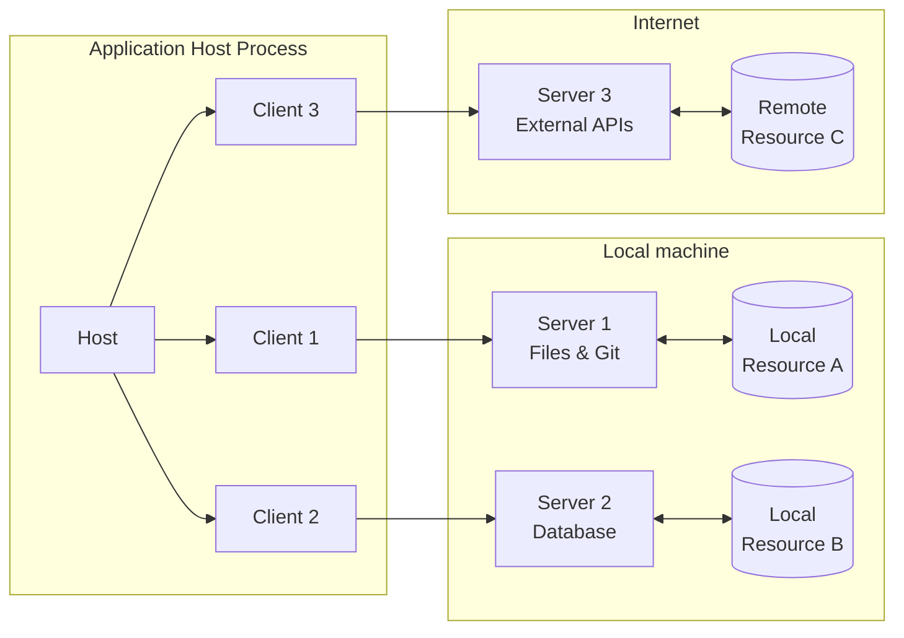

# MCP Fundamentals 🧱

👨‍💼 Hello, my name is Peter the Product Manager. I'm here to help you get
oriented and to give you your assignments for the workshop!

Welcome to **MCP Fundamentals**! In this workshop, you'll dive into the world of
the
[Model Context Protocol (MCP)](https://modelcontextprotocol.io/specification/2025-06-18)—an
open protocol designed to seamlessly connect AI models with external data
sources and tools. Think of MCP as the "USB-C port" for AI applications: it
standardizes how LLMs (Large Language Models) access context, resources, and
capabilities from a wide variety of sources.

Throughout this workshop, you'll learn:

- The core architecture of MCP: **hosts**, **clients**, and **servers**
  ([see architecture](https://modelcontextprotocol.io/specification/2025-06-18/architecture))
- How JSON-RPC powers communication and stateful sessions between components
- How to expose resources, prompts, and tools to LLMs using MCP
- How to build composable, secure, and extensible integrations for AI workflows

We'll focus on the fundamentals—no authentication or authorization required for
our exercises—so you can get hands-on experience with the protocol's most
important features.

If you're curious about the details, I highly recommend checking out the
[official MCP specification](https://modelcontextprotocol.io/specification/2025-06-18)
and the [introduction](https://modelcontextprotocol.io/introduction). These
resources provide a deep dive into the protocol, its design principles, and
practical implementation tips.

Ready to connect your AI to the world? Let's get started!
